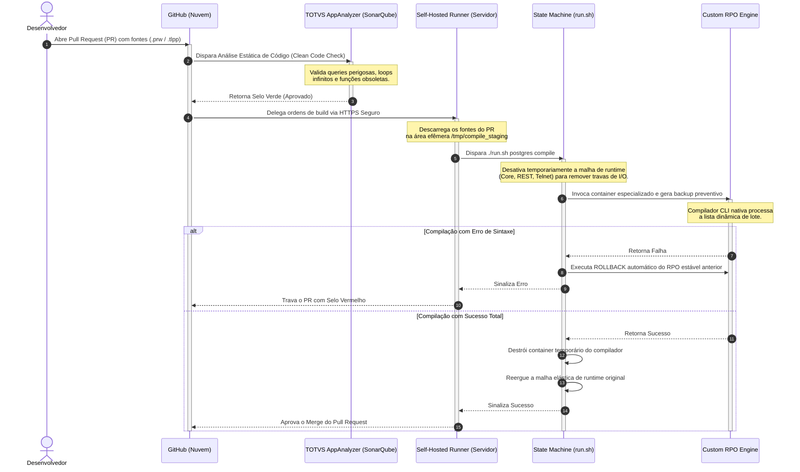

# ADVPL/TLPP Source - Modern DevOps Core 🤖💻

Este repositório centraliza o desenvolvimento de **códigos customizados (ADVPL e TLPP)** para o ecossistema ERP TOTVS Protheus. Ele opera de forma totalmente desacoplada da infraestrutura de contêineres, sendo governado por uma esteira estrita de **GitOps e Continuous Delivery (CD)** via GitHub Actions.

Aqui, a cultura de abrir a IDE conectada diretamente ao servidor de homologação ou produção está **extinta**. Toda e qualquer alteração de código é auditada por análise estática de qualidade e integrada ao RPO via Pull Requests.

---

## 🏗️ Fluxo de Integração Contínua (GitOps Architecture)

O ciclo de vida do código segue um pipeline de validação elástica que garante risco zero de corrupção do repositório de objetos e blindagem contra códigos mal escritos:



### 📂 Estrutura do Repositório

O desenvolvedor possui liberdade total para organizar as camadas de negócio por pastas, contanto que os arquivos mantenham as extensões oficiais suportadas pelo `pipeline` (`.prw` ou `.tlpp` em letras minúsculas)::

```plaintext
advpl-source-modern-devops/
│
├── .github/
│   └── workflows/
│       └── gate-compile.yml # Central de inteligência e governança do GitHub Actions
│
├── src/                    # Raiz obrigatória de todos os códigos do ERP
│   ├── faturamento/
│   │   └── u_meu_fonte.prw
│   ├── financeiro/
│   │   └── u_rotina_tlpp.tlpp
│   └── genericos/
│       └── u_genericos_001.tlpp   
│
└── README.md               # Este guia técnico de engenharia de software
```

### 🛡️ Regras de Governança Aplicadas (Gatekeepers)

Nenhum código entra no repositório de objetos sem passar pelas diretrizes automáticas do `Code Analysis`:

`Queries Seguras`: Bloqueio imediato de expressões como SELECT * sem cláusulas restritivas (WHERE) adequadas aos índices do SGBD (`PostgreSQL/MSSQL/Oracle`)..

`Isolamento de Credenciais`: Proibição estrita de credenciais de banco ou tokens `hardcoded` nos fontes.

`Integridade de Memória`: Auditoria sobre desalocação de objetos e fechamento obrigatório de áreas de tabelas locais abertas em runtime.

`Loops Infinitos`: Estruturas de repetição (`While`) sem o devido tratamento, checagem de fim de arquivo (`EOF`) ou tratamento de travamento.

### 🚀 Guia Passo a Passo para Desenvolvedores (Do `Local` ao `PR`)

Se você acabou de entrar no time ou nunca trabalhou com `GitOps` no ecossistema Protheus, siga rigorosamente este guia passo a passo para enviar suas alterações.

**Passo 1: Preparar o Ambiente Local**

1.Clone este repositório na sua máquina local:

```bash
git clone https://github.com/rodrigomicrosiga/advpl-source-modern-devops.git
cd advpl-source-modern-devops
```

**Passo 2: Criar uma Branch de Trabalho**

Nunca altere códigos diretamente na branch `main`.\
Crie uma branch específica para a sua tarefa:

```bash
# Cria e chaveia para uma nova branch (substitua pelo número da sua tarefa ou recurso)
git checkout -b feature/ajuste-faturamento-SA1
```

**Passo 3: Desenvolver seu Código**

1.Crie ou modifique seus arquivos obrigatoriamente dentro da pasta `src/`.\
2.Garanta que as extensões estão em letras minúsculas (`.prw` ou `.tlpp`).

**Passo 4: Commitar e Enviar ao `GitHub`**

Após finalizar as alterações e testar a sintaxe básica na sua IDE local, registre as modificações usando o padrão de commits do projeto (`Conventional Commits`):

```bash
# Adiciona os arquivos modificados
git add src/faturamento/u_meu_fonte.prw

# Registra o commit com a semântica correta (feat, fix, refactor, etc)
git commit -m "feat(faturamento): implementar rotina customizada de importação SA1 via MVC"

# Envia a sua branch para o GitHub na nuvem
git push origin feature/ajuste-faturamento-SA1
```

**Passo 5: Abrir o `Pull Request` (PR)**

1.Acesse o repositório do `GitHub` pelo navegador.

2.Você verá um aviso sugerindo a abertura de um `Pull Request` para a branch que acabou de enviar. Clique em `Compare & pull request`.

3.Escreva uma descrição clara das modificações e clique em `Create pull request`.

**Passo 6: Monitorar os Robôs de Feedback (A Mágica do `GitOps`)**

Assim que o `PR` for aberto, o `pipeline` do `GitHub Actions` iniciará o monitoramento automático em duas etapas:

**Se o SonarQube ou a Compilação falharem**: O `pipeline` travará o botão de `Merge` com um selo vermelho. O robô irá gerar um comentário automático diretamente no seu `Pull Request` avisando que a compilação quebrou. Você não precisa acessar o servidor: corrija o código, repita os comandos de `git add`, `git commit` e `git push` na mesma `branch`. O `GitHub Actions` reanalisará o código automaticamente.

**Se tudo passar com sucesso**: O robô escreverá um comentário de aprovação no `PR` informando que o código foi integrado ao `custom.rpo` no servidor de forma bem-sucedida e que a malha de runtime elástica já foi atualizada. O Tech Lead estará liberado para revisar o código e realizar o `Merge` definitivo para a branch `main`.

### ⚙️ Guia de Administração e Infraestrutura (Tech Lead / DevOps)

Este bloco é dedicado exclusivamente aos administradores de plataforma que precisam manter o agente receptor ativo no servidor de aplicação.

### 🛡️ Abordagem de Segurança Híbrida

Para mitigar riscos de segurança e vazamentos na internet, este projeto adota a `Abordagem Híbrida de Segredos`. Nenhuma credencial de banco de dados, token ou senha do Protheus é cadastrada nas `Secrets` do GitHub.
O pipeline na nuvem apenas orquestra o fluxo de controle. A execução real ocorre dentro do servidor via `Self-Hosted Runner`, herdando as credenciais locais e protegidas que residem fisicamente nos arquivos `.env` e .`env.postgres` (Ou de outro banco que esteja utilizando) do host local.

### 📦 Instalação Passo a Passo do Self-Hosted Runner no Servidor Linux

Se você precisa vincular este servidor ao `GitHub` para que ele passe a receber e processar os `Pull Requests` automaticamente, execute os passos abaixo diretamente no terminal do host:

**Passo 1: Criar uma pasta isolada na `Home` do Usuário**
_Nunca_ instale ou extraia os arquivos do Runner dentro da pasta do seu repositório Git, para não poluir o versionamento com binários do agente.

```bash
# Cria uma pasta limpa e dedicada na home do usuário rodrigo
mkdir -p /home/rodrigo/actions-runner && cd /home/rodrigo/actions-runner
```

**Passo 2: Obter o Token Atualizado no Painel do GitHub**

1.Acesse o GitHub no navegador, entre no repositório `advpl-source-modern-devops`.

2.Vá em `Settings` > `Actions` > `Runners` > `New self-hosted runner`.

3.Selecione a plataforma `Linux` e a `arquitetura X64`. (com base em sua arquitetura)

**Passo 3: Baixar e Extrair o Agente no Servidor**

Copie os comandos gerados na tela do seu GitHub (eles serão idênticos aos listados abaixo, mudando apenas a versão do pacote):

```bash
# Baixa o pacote oficial do runner do GitHub
curl -o actions-runner-linux-x64.tar.gz -L https://github.com/actions/runner/releases/download/v2.317.0/actions-runner-linux-x64.tar.gz

# Valida a integridade do download via hash SHA-256
echo "963e69006bdf561...  actions-runner-linux-x64.tar.gz" | shasum -a 256 -c

# Extrai os arquivos do instalador
tar -xzf ./actions-runner-linux-x64.tar.gz
```

**Passo 4: Registrar o Runner na API do GitHub**

Execute o script de configuração copiando a linha exata que o GitHub exibe na tela. O `token` gerado expira em 1 hora, portanto gere um novo se o comando falhar com erro 404:

```bash
./config.sh --url https://github.com/rodrigomicrosiga/advpl-source-modern-devops --token SEU_TOKEN_GERADO_NA_TELA
```

* O assistente perguntará o nome do grupo de `runners`: Pressione `Enter` (Padrão).

* Perguntará o nome do `runner`: Pressione `Enter` (Ele herdará o nome do servidor).

* Perguntará as labels: Certifique-se de manter ou digitar `self-hosted` (ela é o vínculo com a diretiva `runs-on: self-hosted` do workflow).

* Perguntará a pasta de trabalho (`work folder`): Pressione `Enter` (Padrão _work).

**Passo 5: Transformar o Runner em um Serviço Nativo do Sistema (`systemd`)**

Para garantir que o robô não pare de rodar se você fechar o terminal ou se o servidor for reiniciado, registre-o como um serviço permanente do Linux usando privilégios de `sudo`:

```bash
# Instala o script de inicialização no systemd da máquina
sudo ./svc.sh install

# Inicializa o serviço do agente em background imediatamente
sudo ./svc.sh start
```

Após executar este comando, vá até o painel do GitHub em `Settings` > `Actions` > `Runners` e verifique se o status do robô mudou para uma bolinha Verde (`Idle`). Ele está pronto para o combate.


### 🔧 Gerenciamento do Serviço do Runner no Servidor

O robô do GitHub opera como um serviço nativo do `systemd` em background no servidor. Se houver necessidade de manutenção, gerenciamento ou reinicialização do agente, utilize os comandos abaixo no diretório dedicado do runner (fora da estrutura do repositório Git):

```bash
# Acessar a pasta isolada do runner no host
cd /home/rodrigo/actions-runner/

# Verificar o status operacional do robô do GitHub
sudo ./svc.sh status

# Parar o serviço temporariamente
sudo ./svc.sh stop

# Iniciar o serviço do agente receptor
sudo ./svc.sh start

# Desinstalar o serviço do sistema (caso mude de servidor)
sudo ./svc.sh uninstall
```

_Nota: Certifique-se de que a variável `working-directory` dentro do arquivo `.github/workflows/gate-compile.yml` esteja apontando cirurgicamente para a pasta absoluta onde os containers da infraestrutura Protheus (`totvs-protheus-modern-devops`) residem no host operacional, para que o comando `./run.sh` encontre os perfis do `Docker Compose`._

_Nota: O aviso sobre o Node.js 20/24 é apenas uma notificação de depreciação interna do próprio GitHub Actions sobre a imagem base deles, não afeta em nada o funcionamento da esteira_.