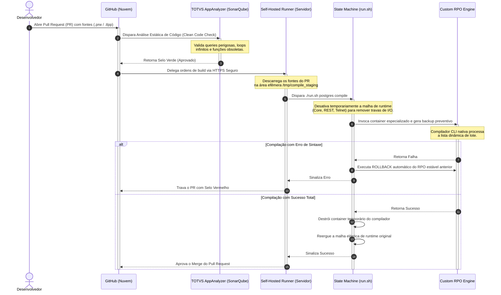

# ADVPL/TLPP Source - Modern DevOps Core 🤖💻

Este repositório centraliza o desenvolvimento de **códigos customizados (ADVPL e TLPP)** para o ecossistema ERP TOTVS Protheus. Ele opera de forma totalmente desacoplada da infraestrutura de contêineres, sendo governado por uma esteira estrita de **GitOps e Continuous Delivery (CD)** via GitHub Actions.

Aqui, a cultura de abrir a IDE conectada diretamente ao servidor de homologação ou produção está **extinta**. Toda e qualquer alteração de código é auditada por análise estática de qualidade e integrada ao RPO via Pull Requests.

---

## 🏗️ Fluxo de Integração Contínua (GitOps Architecture)

O ciclo de vida do código segue um pipeline de validação elástica que garante risco zero de corrupção do repositório de objetos e blindagem contra códigos mal escritos:



### 📂 Estrutura do Repositório

O desenvolvedor possui liberdade total para organizar as camadas de negócio por pastas, contanto que os arquivos mantenham as extensões oficiais suportadas pelo `pipeline`:

```plaintext
advpl-source-modern-devops/
│
├── .github/
│   └── workflows/
│       └── gate-compile.yml # Central de inteligência e governança do GitHub Actions
│
├── src/                    # Raiz obrigatória de todos os códigos do ERP
│   ├── faturamento/
│   │   └── u_meu_fonte.prw
│   ├── financeiro/
│   │   └── u_rotina_tlpp.tlpp
│   └── genericos/
│       └── u_genericos_001.tlpp   
│
└── README.md               # Este guia técnico de engenharia de software
```

### 🛡️ Regras de Governança Aplicadas (Gatekeepers)

Nenhum código entra no repositório de objetos sem passar pelas diretrizes automáticas do `Code Analysis`:

`Queries Seguras`: Bloqueio imediato de expressões como SELECT * sem cláusulas restritivas (WHERE) adequadas aos índices do SGBD.

`Isolamento de Credenciais`: Proibição estrita de credenciais de banco ou tokens hardcoded nos fontes.

`Integridade de Memória`: Auditoria sobre desalocação de objetos e fechamento obrigatório de áreas de tabelas locais abertas em runtime.